# Considerações iniciais

* R executa linha por linha (por isso não precisa informar onde acaba o código ";").
* Comentários são feitos por linha e tudo depois do símbolo "#" é ignorado pelo interpretador do R.
* Para ajuda dentro do R utiliza-se duas interrogações seguidas da palavra (ou expressão) de interesse. Exemplo: `??regression`.
* Para acessar a documentação de alguma função, basta digitar uma única interrogação antes do nome da função. Exemplo: `?lm`.
* O R é *case-sensitive*!
* Neste documento, os resultados dos comandos executados no R que são mostrados no console são apresentados nas imagens em que cada linha começa com `##` (para que se possa copiar o código e o resultado que estará na forma de cometário).


```{r options, echo = FALSE}
#install.packages("highr")
#install.packages("stringr")

options(width = 80)

knitr::knit_hooks$set(source = function(x, options) {
  if (!is.null(options$hilang)) {
      code_open <- "\n\n<div class=\"sourceCode\">\n<pre class=\"sourceCode\">\n<code class=\"sourceCode\">"
      code_close <- "\n</code>\n</pre>\n</div>\n"
      code_body <- highr::hi_andre(x, language = options$hilang, format = "pdf")
    stringr::str_c(
      code_open,
      knitr:::indent_block(paste(code_body, collapse = '\n'), ""),
      code_close
    )
  } else {
    stringr::str_c("\n\n```", tolower(options$engine), "\n",
                   paste(x, collapse = '\n'), "\n```\n\n")
      
  }
})
```


# Importação dados a partir de arquivo texto

### SAS

```{r eval = FALSE, hilang = 'sas'}
Data A; /*IMPORTAÇÃO DE DADOS A PARTIR DE UM ARQUIVO DE TEXTO*/
Infile "C:\Users\bah_m\OneDrive\Documentos2\Doutorado\Disciplinas\Grupo de estudos_R\Ovinos.dat";
Input Animal$ 1-12 Pai$ 14-25 Mae$ 27-38 NascMae 40-43 Sx$ 45 DN 47-53 PN 56-58 .1 GMJD$ 60 DD 62-69 PD 71-72 CND 74 PRD 76 
    MCD 78 GMJS$ 80 DS 82-89 PS 91-93 CNS 95 PRS 97 MCS 99 TParto 101 anonasc 103-106 idmae 108-109 idd 111-113 ids 115-117 
	GC 119-120 Ano 122-125 PE 127-128 IPP 130-131 p180 133-134 IDMO 136-137;
Proc print; /*IMPRIMIR DADOS NO OUTPUT*/
Run; /*RODAR O QUE ESTÁ DENTRO DO DATA*/
```

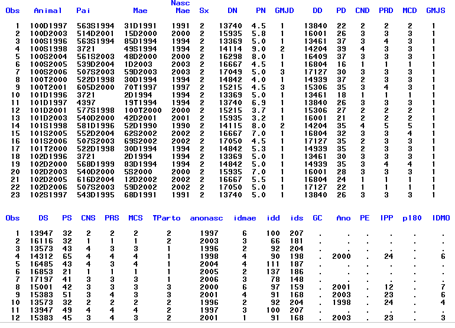

### R

```{r}
# Arquivos com largura fixa (fixed width format) devem ser lidos com `read.fwf`
dataA <- read.fwf("Ovinos.dat"
              , widths = c(12, -1, 12, -1, 12, -1, 4, -1, 1, -1, 7, -2, 3, -1, 1, -1, 8, -1, 2, -1, 1, -1, 1, -1, 1, -1, 1, -1, 8, -1, 3, -1, 1, -1, 1, -1, 1, -1, 1, -1, 4, -1, 2, -1, 3, -1, 3, -1, 2, -1, 4, -1, 2, -1, 2, -1, 2, -1, 2) # indicar a quantidade de caracteres para cada variável. O negativo indica ignorar aquela quantidade de caracteres
              , col.names = c("Animal", "Pai", "Mae", "NascMae", "Sx", "DN", "PN", "GMJD", "DD", "PD", "CND", "PRD", "MCD", "GMJS", "DS", "PS", "CNS", "PRS", "MCS", "TParto", "anonasc", "idmae", "idd", "ids", "GC", "Ano", "PE", "IPP", "p180", "IDMO")
              , stringsAsFactor = FALSE)

# leitura de arquivos com tamanho fixo faz com que espaços em branco façam parte de cada observação

# uma forma interessante de verificar os dados é usando a função `str`
str(dataA)

# Para retirar os espaços em branco das extremidades:
for(i in names(dataA)){
  dataA[, i] <- trimws(dataA[, i])
}

# função head mostrará as primeiras n observações (default = 6)
head(dataA, n = 10)

# Outra forma de visualizar é escolhendo as linhas
dataA[70:80, ]

# No R, deve-se usar `NA` para informação perdida
dataA[dataA == "."] <- NA
```

***

# "Sorteio" de dados

### SAS

```{r eval = FALSE, hilang = 'sas'}
Data B; 
Set A; /*CHAMAR ARQUIVOS PRESENTES NOS DADOS ANTERIORES*/
Proc sort; by Sx; /*SORTEIO DE DADOS DO MAIOR PARA O MENOR OU EM ORDEM ALFABÉTICA*/
Proc print; Run;
```

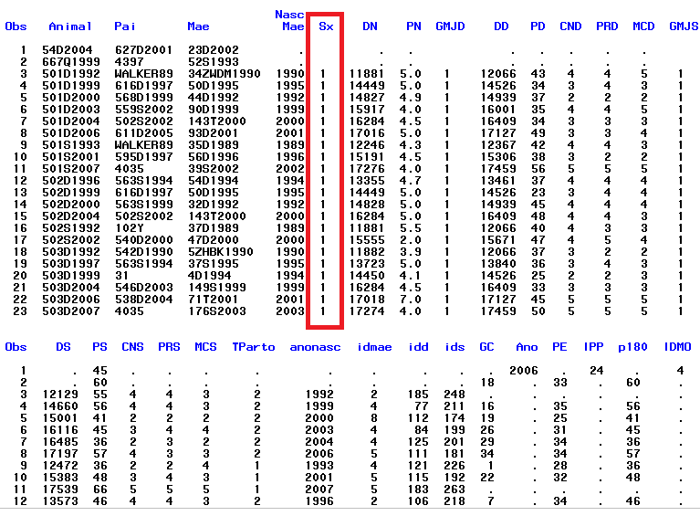

### R

```{r}
dataB <- dataA[order(dataA$Sx), ]

head(dataB)
```


# Apresentação somente primeira aparição da variável selecionada

### SAS

```{r eval = FALSE, hilang = 'sas'}
Data C; Set A;
Proc sort nodupkey; by Anonasc; /*O NODUPKEY APRESENTA SOMENTE A PRIMEIRA APARIÇÃO DE CADA NÍVEL DA VARIÁVEL SORTEADA*/
Proc print; Run;
```

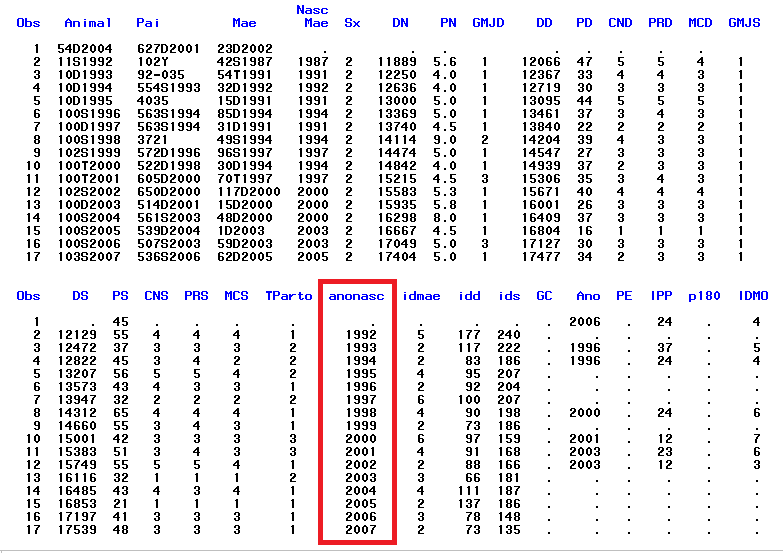

### R

```{r}
dataC <- dataA[order(dataA$anonasc, na.last = FALSE),] # ordenando

dataC <- dataC[!duplicated(dataC$anonasc),] # excluindo os que nao sao os primeiros

dataC
```


# Formação e numeração de grupo de contemporâneos - _Parcial..._

### SAS

```{r eval = FALSE, hilang = 'sas'}
Data D; Set A;
Proc sort; by anonasc gmjd sx; /*SORTEIO PRIMEIRO POR ANO DE NASCIMENTO, DEPOIS POR GRUPO DE MANEJO E POR ÚLTIMO POR SEXO*/
Proc print; Run;
```

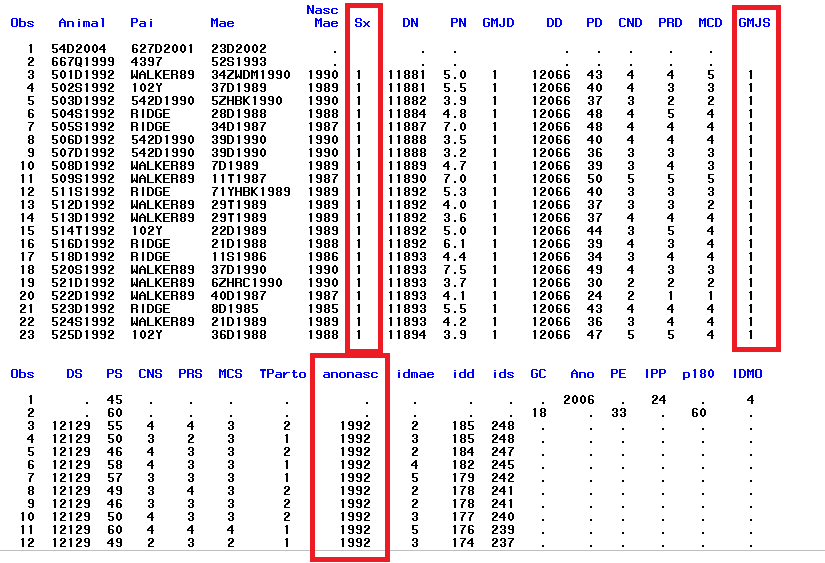

### R

```{r}
# Ordenando por ano de nascimento, grupo de manejo e sexo
dataD <- dataA[order(dataA$anonasc, dataA$GMJD, dataA$Sx, na.last = FALSE), ]

head(dataD)
```

### SAS

```{r eval = FALSE, hilang = 'sas'}
Data E; Set D;
GC1 = anonasc||gmjd||sx; /*VARIÁVEIS QUE VÃO FORMAR O GRUPO DE CONTEMPORÂNEOS*/
Proc sort; by GC1;
Proc print; Run;
```

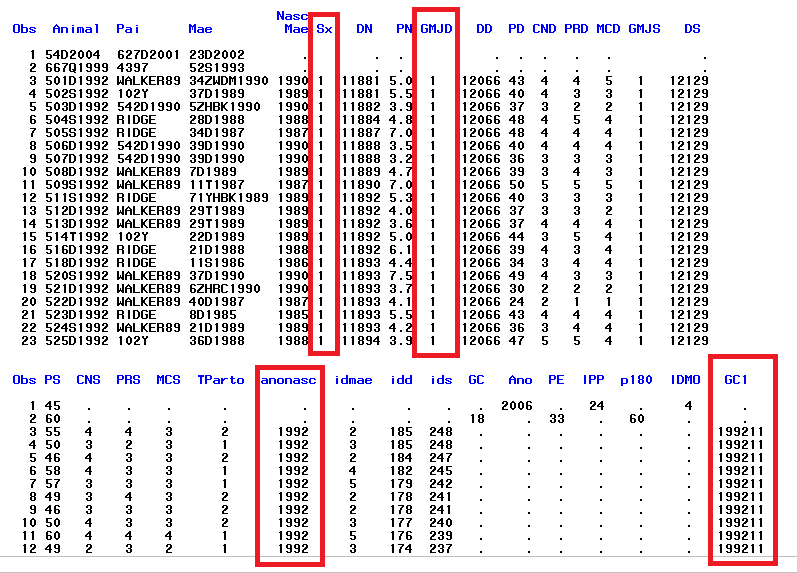

### R

```{r}
dataE <- dataD
# Criando a variável GC1
dataE$GC1 <- paste(dataE$anonasc, dataE$GMJD, dataE$Sx, sep = "")

# Observe que o paste tranforma `NA` em caractere perdendo sua funcionalidade original

# Corrigindo as informações perdidas
dataE[dataE$GC1 == "NANANA", "GC1"] <- NA

head(dataE)
```

### SAS

```{r eval = FALSE, hilang = 'sas'}
Data F; Set E;
GC2 = lag(GC1); /*LAG - REPETE UMA VARIÁVEL UMA LINHA ABAIXO. USAMOS BASTANTE PARA COMPARAR DADOS*/
If GC1 not= GC2 then GC3+1; /*PROCEDIMENTO IF E NUMERAÇÃO SEQUENCIAL*/
Proc print; Run;
```

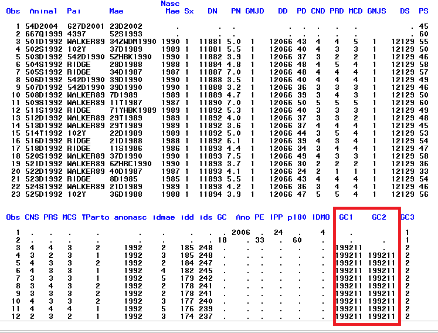

### R

```{r}
dataF <- dataE
dataF$GC2 <- c(NA, head(dataF$GC1, -1)) # equivalente lag do SAS

# Como o SAS implicitamente funciona como um loop nessas estruturas de `Data`, a forma mais parecida de renumerar no R necessitará de um "loop" explícito e o R não é bom nisso. Por isso, o grupo será renumerado com uso de duas funções simples e sem necessitar do GC2

dataF$GC3 <- as.numeric(factor(dataF$GC1, exclude = NULL)) # exclude NULL para montar um fator com NA, nesse caso ele será o último fator. Por default a função `factor` ignora o NA

head(dataF)
```


### SAS

```{r eval = FALSE, hilang = 'sas'}
Data G; Set F;
Proc freq; Table GC3/out=x; /*NOVA MEMÓRIA COM A SAÍDA "X", ONDE O NGC É A CONTAGEM QUE FOI FEITA - CONTAR ANIMAIS DENTRO DE GC*/
Run;
```

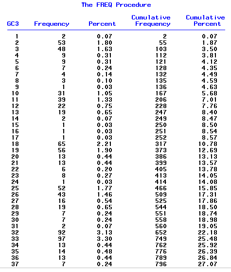

### R

```{r}
table(dataF$GC3)

x <- as.data.frame(table(dataF$GC3)) # salvando a frequência como data.frame em x
```


### SAS

```{r eval = FALSE, hilang = 'sas'}
Data H; Set X;
NGC = count; /*VARIÁVEL CONTADORA*/
Drop count percent; /*DROP - COMANDO PARA RETIRAR COLUNAS QUE NÃO SERÃO MAIS NECESSÁRIAS*/
Proc print; Run;
```

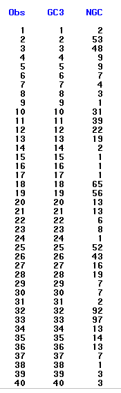

### R

```{r}
names(x) <- c("GC3", "NGC") # Renomeia as variáveis
head(x)
```

### SAS

```{r eval = FALSE, hilang = 'sas'}
Data I; 
Merge F H; By GC3; /*MERGE - JUNTAR DADOS COLOCANDO AS COLUNAS LADO A LADO*/
If NGC < 15 then delete;
Proc print; Run;
```

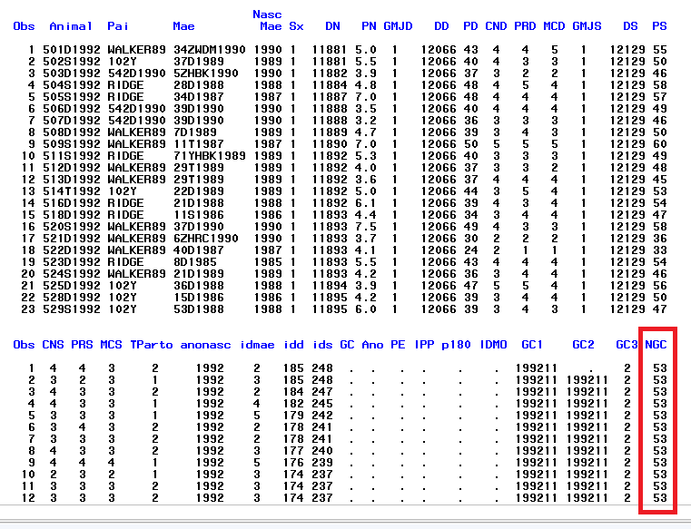

### R

```{r}
# Observe que não foi necessário criar dataG já que o resultado foi gravado em x e nem o dataH pois o table só faz a frequência absoluta que é de interesse. O equivalente ao DROP será mostrado mais adiante

dataI <- merge(dataF, x, by = "GC3", all.x = TRUE)
dataI <- dataI[!(dataI$NGC < 15), ] 

head(dataI)
```


### SAS

```{r eval = FALSE, hilang = 'sas'}
Data J; Set I;
GC4 = lag(NGC);
If NGC not= GC4 then GC+1;
Proc print; Run;
```

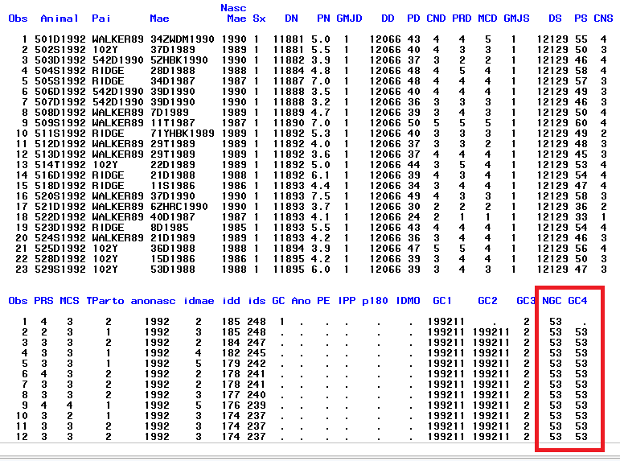


### R

```{r}
# ???????????????????
#dataJ$GC <- as.numeric(factor(dataI$NGC, levels = unique(dataI$NGC), exclude = NULL))

dataJ <- dataI

dataJ$GC4 <- c(NA, head(dataJ$NGC, -1))

gci <- 1
for(i in 1:nrow(dataJ)){
  if((dataJ$NGC[i] != dataJ$GC4[i]) | is.na(dataJ$GC4[i])){
    dataJ$GC[i] <- gci
    gci <- gci+1
  }
}

head(dataJ)
```


# ~~Análise de variância dados desbalanceados~~ (não foi possível reproduzir)

### SAS
```{r eval = FALSE, hilang = 'sas'}
Data K; Set J;
Proc GLM; /*ANÁLISE DE VARIÂNCIA DE DADOS DESBALANCEADOS*/
Class GC; /*EFEITOS FIXOS*/
Model PE = GC ids /solution; /*O SOLUTION PERMITE QUE O PROGRAMA APRESENTE AS SOLUÇÕES DOS NÍVEIS DOS EFEITOS FIXOS, 
									   APRESENTA O INTERCEPTO E OS BETAS PARA A REGRESSÃO*/
Run;
```

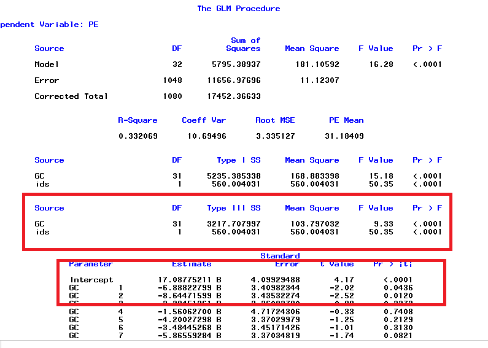

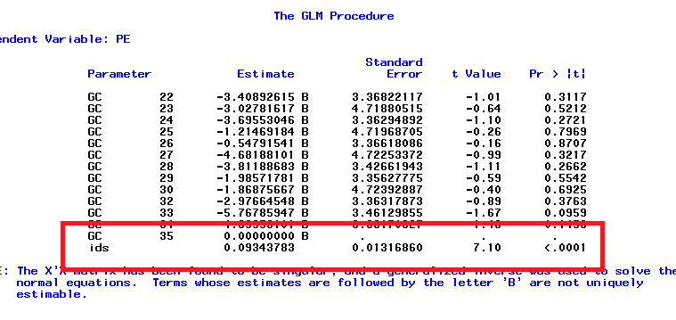

### R
```{r}
# Reconhecendo os tipos de variáveis que irão compor o modelo
dataJ$GC <- factor(as.numeric(dataJ$GC)) # isso é o equivalente ao informado no `Class` do Proc GLM do SAS

dataJ$ids <- as.numeric(dataJ$ids)

dataJ$PE <- as.numeric(dataJ$PE)

# vamos armezenar no objeto dataK o resultado da função lm
dataK <- lm(PE ~ GC + ids, data = dataJ)

# em dataK já teremos então as soluções do modelo
dataK

# para mais detalhes usamos as funções `summary`
summary(dataK)

# a soma de quadrados é do tipo sequencial, equivalente ao Type I do GLM do SAS
# Para ter a soma de quadrados equivalente ao tipo III do GLM do SAS basta mudar a ordem das variáveis no modelo e utilizar a soma de quadrados da última variável (VÁLIDO SOMENTE COM MODELOS SEM INTERAÇÃO).
anova(dataK)

# Ou usando a função drop1 e solicitando o teste F. 
drop1(dataK, test = "F")
```

Incompatilidade dos resultados devido ao problema na formação dos grupos contemporâneos. Observe a diferença de graus de liberdade para este fator.

# Fator de correção do perímetro escrotal para idade

### SAS

```{r eval = FALSE, hilang = 'sas'}
Data L; Set J;
PEIDS = 17.08775211 + (0.09343783*IDS); /*REGRESSÃO PARA TER O PERÍMETRO PREDITO*/
Output;
Do IDS = 128 TO 265 BY 1; /*PARA PROCURAR CADA NÍVEL DA VARIÁVEL QUE VAI SER USADA NA CORREÇÃO E COLOCAR O PERÍMETRO PREDITO*/
End;
Proc print; Run;
```

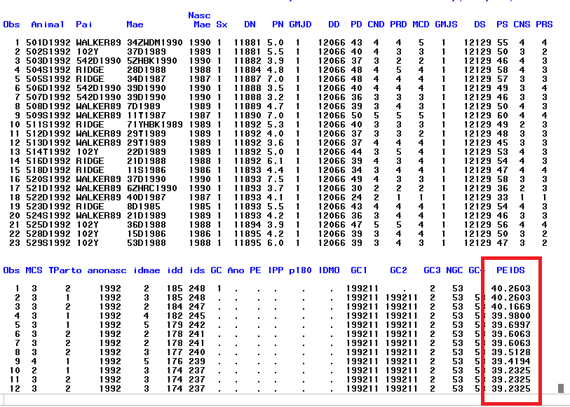
### R

```{r}
dataL <- dataJ

# cria a variável PEIDS com base em ids
dataL$PEIDS <- 17.08775211 + (0.09343783*dataL$ids)

# Aqui é para restringir a criação dessa variável somente para os animais com ids no intervalo entre 128 e 265 dias
dataL[dataL$ids >= 128 & dataL$ids <= 265, ]$PEIDS <- 17.08775211 + (0.09343783*dataL[dataL$ids >= 128 & dataL$ids <= 265, "ids"])

head(dataL)
```


### SAS

```{r eval = FALSE, hilang = 'sas'}
DATA M; SET L;
PROC MEANS; VAR IDS;
PROC SORT; BY IDS; /*SORTEAR PARA ACHAR O ANIMAL COM O VALOR PADRÃO DE IDADE, OU SEJA, O VALOR PARA QUAL SE QUER CORRIGIR*/
PROC PRINT; RUN;
```

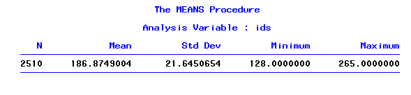

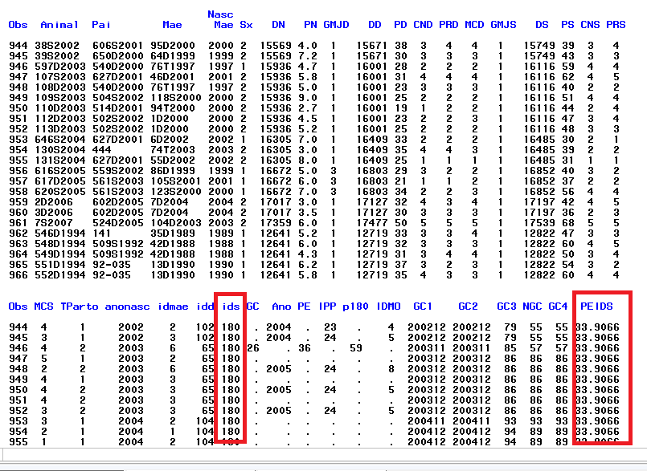

### R

```{r}
summary(dataL$ids)

length(dataL$ids) # N
mean(dataL$ids)   # Mean
sd(dataL$ids)     # Std Dev
min(dataL$ids)    # Minimum
max(dataL$ids)    # Maximum

dataM <- dataL[order(dataL$ids), ]

dataM[dataM$ids == 180, ]
```

### SAS

```{r eval = FALSE, hilang = 'sas'}
DATA N; SET M;
FCIDS = 33.9066/PEIDS; /*O FATOR DE CORREÇÃO SERÁ O PERÍMETRO DO PADRÃO DIVIDIDO PELO PERÍMETRO PREDITO DO ANIMAL*/
Proc print; RUN;
```

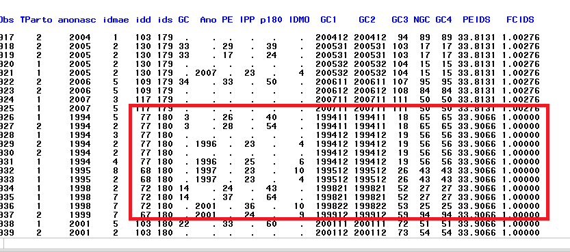

### R

```{r}
dataN <- dataM

unique(dataM[dataM$ids == 180, "PEIDS"])

dataN$FCIDS <- 33.9066/dataN$PEIDS

dataN[923:936, ]
```


### SAS

```{r eval = FALSE, hilang = 'sas'}
DATA O; SET N;
PEFCIDS = PE*FCIDS; /*PERÍMETRO CORRIGIDO*/
PROC SORT; BY IDS;
Proc print; RUN;
```

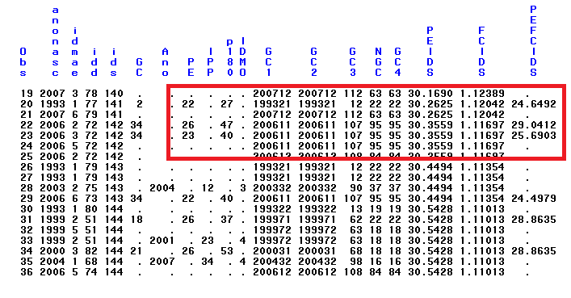


### R

```{r}
dataO <- dataN

dataO$PEFCIDS <- dataO$PE*dataO$FCIDS

dataO <- dataO[order(dataO$ids),]

dataO[19:24,]
```


# Salvando dados em arquivo formato texto

### SAS

```{r eval = FALSE, hilang = 'sas'}
Data P; Set O;
File "C:\Users\bah_m\OneDrive\Documentos2\Doutorado\Disciplinas\Grupo de estudos_R\Ovinos2.dat";
Put Animal$ 1-12 Pai$ 14-25 Mae$ 27-38 NascMae 40-43 Sx$ 45 DN 47-53 PN 56-58 .1 GMJD$ 60 DD 62-69 PD 71-72 CND 74 PRD 76 
    MCD 78 GMJS$ 80 DS 82-89 PS 91-93 CNS 95 PRS 97 MCS 99 TParto 101 anonasc 103-106 idmae 108-109 idd 111-113 ids 115-117 
	Ano 119-121 PE 123-124 IPP 126-127 p180 129-130 IDMO 132-133 GC 135-136 PEIDS 138-142 .2 FCIDS 144-150 .5 PEFCIDS 152-156 .2 ;
run;	
```

### R

```{r, warning=FALSE}
# Para salvar arquivos com largura fixa precisaremos de um pacote

# Instalar o pacote:
#install.packages("gdata")

# "Chamar" o pacote
require(gdata)

write.fwf(dataO[, c("Animal", "Pai", "Mae", "NascMae", "Sx", "DN", "PN", "GMJD", "DD", "PD", "CND", "PRD", "MCD", "GMJS", "DS", "PS", "CNS", "PRS", "MCS", "TParto", "anonasc", "idmae", "idd", "ids", "Ano", "PE", "IPP", "p180", "IDMO", "GC", "PEIDS", "FCIDS", "PEFCIDS")], file = "Ovinos2.dat")

# Pode especificar a largura de cada variável ou se aproveitar do princípio da reciclagem do R, indicando somente 1 largura
write.fwf(dataO[, c("Animal", "Pai", "Mae", "NascMae", "Sx", "DN", "PN", "GMJD", "DD", "PD", "CND", "PRD", "MCD", "GMJS", "DS", "PS", "CNS", "PRS", "MCS", "TParto", "anonasc", "idmae", "idd", "ids", "Ano", "PE", "IPP", "p180", "IDMO", "GC", "PEIDS", "FCIDS", "PEFCIDS")], file = "Ovinos2.dat", width = 13)
```


---


# Importar em Excel

### SAS

```{r eval = FALSE, hilang = 'sas'}
PROC IMPORT OUT= WORK.A 
            DATAFILE= "C:\Users\bah_m\Desktop\Cláudia Zago\SAS_R_Andre\data_inicial.xlsx" 
            DBMS=EXCELCS REPLACE;
     RANGE="data_inicial"; 
     SCANTEXT=YES;
     USEDATE=YES;
     SCANTIME=YES;
RUN; /* 2997 observations and 187 variables */
```

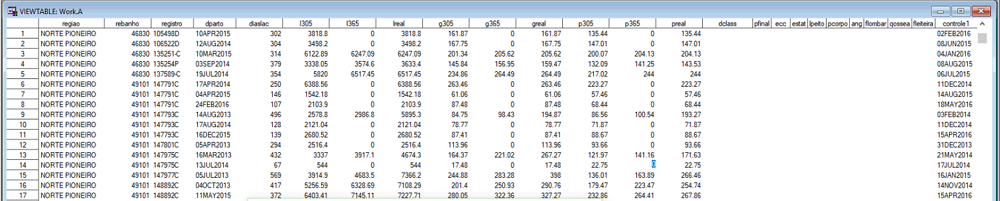


### R

```{r}
# Usando pacote readxl. Para instalar, utilize install.packages("readxl")
dataA <- as.data.frame(readxl::read_excel("data_inicial.xlsx", sheet = "data_inicial")) # além de ler caracteres como caracteres mesmo, já entende as datas corretamente.

dataA[1:10, 1:25]
```


# Apagar informações que não serão utilizadas

### SAS

```{r eval = FALSE, hilang = 'sas'}
/* APAGAR INFORMAÇÕES QUE NÃO SERÃO UTILIZADAS */
DATA B; SET A;
DROP REGIAO L365 LREAL G365 GREAL P365 PREAL DCLASS PFINAL ECC ESTAT LPEITO PCORPO ANG FLOMBAR QOSSEA FLEITEIRA DENCERRAMENTO DIASLAC F23
CONTROLE5 CONTROLE6 CONTROLE7 CONTROLE8 CONTROLE9 CONTROLE10 CONTROLE11 CONTROLE12 CONTROLE13 CONTROLE14 CONTROLE15  
CONTROLE16 CONTROLE17 CONTROLE18 CONTROLE19 CONTROLE20

LCONTROLE1 LCONTROLE2 LCONTROLE3 LCONTROLE4 LCONTROLE5 LCONTROLE6 LCONTROLE7 LCONTROLE8 LCONTROLE9 LCONTROLE10 LCONTROLE11 LCONTROLE12 LCONTROLE13 LCONTROLE14 LCONTROLE15
LCONTROLE16 LCONTROLE17 LCONTROLE18 LCONTROLE19 LCONTROLE20

GCONTROLE1 GCONTROLE2 GCONTROLE3 GCONTROLE4 GCONTROLE5 GCONTROLE6 GCONTROLE7 GCONTROLE8 GCONTROLE9 GCONTROLE10 GCONTROLE11 GCONTROLE12 GCONTROLE13 GCONTROLE14 GCONTROLE15
GCONTROLE16 GCONTROLE17 GCONTROLE18 GCONTROLE19 GCONTROLE20

PCONTROLE1 PCONTROLE2 PCONTROLE3 PCONTROLE4 PCONTROLE5 PCONTROLE6 PCONTROLE7 PCONTROLE8 PCONTROLE9 PCONTROLE10 PCONTROLE11 PCONTROLE12 PCONTROLE13 PCONTROLE14 PCONTROLE15
PCONTROLE16 PCONTROLE17 PCONTROLE18 PCONTROLE19 PCONTROLE20

LACCONTROLE1 LACCONTROLE2 LACCONTROLE3 LACCONTROLE4 LACCONTROLE5 LACCONTROLE6 LACCONTROLE7 LACCONTROLE8 LACCONTROLE9 LACCONTROLE10 LACCONTROLE11 LACCONTROLE12 LACCONTROLE13
LACCONTROLE14 LACCONTROLE15 LACCONTROLE16 LACCONTROLE17 LACCONTROLE18 LACCONTROLE19 LACCONTROLE20

SOLCONTROLE1 SOLCONTROLE2 SOLCONTROLE3 SOLCONTROLE4 SOLCONTROLE5 SOLCONTROLE6 SOLCONTROLE7 SOLCONTROLE8 SOLCONTROLE9 SOLCONTROLE10 SOLCONTROLE11 SOLCONTROLE12 SOLCONTROLE13
SOLCONTROLE14 SOLCONTROLE15 SOLCONTROLE16 SOLCONTROLE17 SOLCONTROLE18 SOLCONTROLE19 SOLCONTROLE20
 
CCSCONTROLE1 CCSCONTROLE2 CCSCONTROLE3 CCSCONTROLE4 CCSCONTROLE5 CCSCONTROLE6 CCSCONTROLE7 CCSCONTROLE8 CCSCONTROLE9 CCSCONTROLE10 CCSCONTROLE11 CCSCONTROLE12 CCSCONTROLE13
CCSCONTROLE14 CCSCONTROLE15 CCSCONTROLE16 CCSCONTROLE17 CCSCONTROLE18 CCSCONTROLE19 CCSCONTROLE20

COBERTURA1 COBERTURA2 COBERTURA3 COBERTURA4 COBERTURA5 COBERTURA6 COBERTURA7 COBERTURA8 COBERTURA9 COBERTURA10 COBERTURA11 COBERTURA12 COBERTURA13 COBERTURA14 COBERTURA15;
RUN; /* 2997 observations and 16 variables */
```

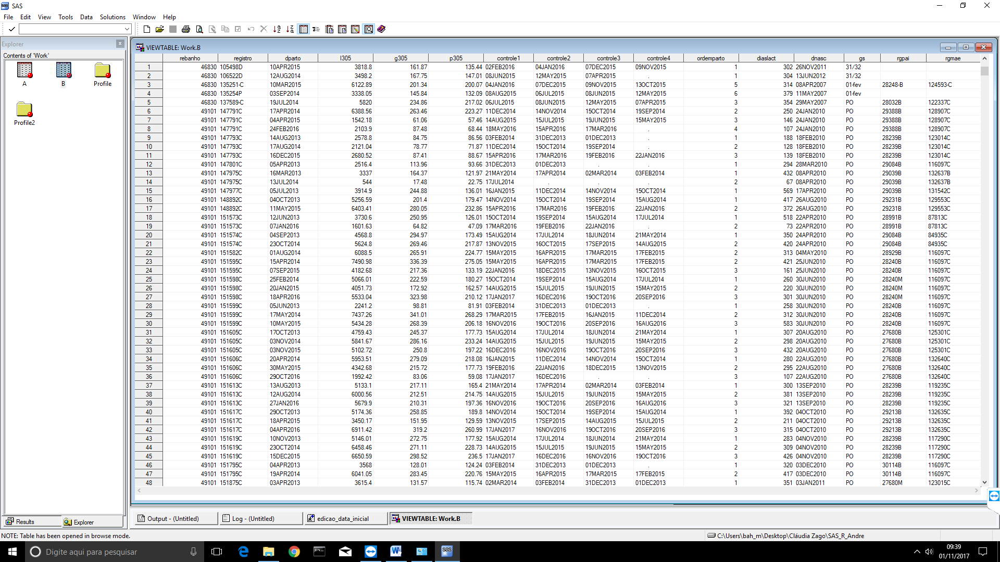

### R

```{r}
names(dataA)

dataB <- dataA[, !(names(dataA) %in% c("regiao", "l365", "lreal", "g365", "greal", "p365", "preal", "dclass", "pfinal", "ecc", "estat", "lpeito", "pcorpo", "ang", "flombar", "qossea", "fleiteira", "dencerramento", "diaslac", "F23", 
                              "lcontrole1", "gcontrole1", "pcontrole1", "laccontrole1", "solcontrole1", "ccscontrole1", "lcontrole2", "gcontrole2", "pcontrole2", "laccontrole2", "solcontrole2", "ccscontrole2", "lcontrole3", "gcontrole3", "pcontrole3", "laccontrole3", "solcontrole3", "ccscontrole3", "lcontrole4", "gcontrole4", "pcontrole4", "laccontrole4", "solcontrole4", "ccscontrole4", "controle5", "lcontrole5", "gcontrole5", "pcontrole5", "laccontrole5", "solcontrole5", "ccscontrole5", "controle6", "lcontrole6", "gcontrole6", "pcontrole6", "laccontrole6", "solcontrole6", "ccscontrole6", "controle7", "lcontrole7", "gcontrole7", "pcontrole7", "laccontrole7", "solcontrole7", "ccscontrole7", "controle8", "lcontrole8", "gcontrole8", "pcontrole8", "laccontrole8", "solcontrole8", "ccscontrole8", "controle9", "lcontrole9", "gcontrole9", "pcontrole9", "laccontrole9", "solcontrole9", "ccscontrole9", "controle10", "lcontrole10", "gcontrole10", "pcontrole10", "laccontrole10", "solcontrole10", "ccscontrole10", "controle11", "lcontrole11", "gcontrole11", "pcontrole11", "laccontrole11", "solcontrole11", "ccscontrole11", "controle12", "lcontrole12", "gcontrole12", "pcontrole12", "laccontrole12", "solcontrole12", "ccscontrole12", "controle13", "lcontrole13", "gcontrole13", "pcontrole13", "laccontrole13", "solcontrole13", "ccscontrole13", "controle14", "lcontrole14", "gcontrole14", "pcontrole14", "laccontrole14", "solcontrole14", "ccscontrole14", "controle15", "lcontrole15", "gcontrole15", "pcontrole15", "laccontrole15", "solcontrole15", "ccscontrole15", "controle16", "lcontrole16", "gcontrole16", "pcontrole16", "laccontrole16", "solcontrole16", "ccscontrole16", "controle17", "lcontrole17", "gcontrole17", "pcontrole17", "laccontrole17", "solcontrole17", "ccscontrole17", "controle18", "lcontrole18", "gcontrole18", "pcontrole18", "laccontrole18", "solcontrole18", "ccscontrole18", "controle19", "lcontrole19", "gcontrole19", "pcontrole19", "laccontrole19", "solcontrole19", "ccscontrole19", "controle20", "lcontrole20", "gcontrole20", "pcontrole20", "laccontrole20", "solcontrole20", "ccscontrole20", "cobertura1", "cobertura2", "cobertura3", "cobertura4", "cobertura5", "cobertura6", "cobertura7", "cobertura8", "cobertura9", "cobertura10", "cobertura11", "cobertura12", "cobertura13", "cobertura14", "cobertura15"))]

dim(dataB)
```


# Comando para organizar informações em linhas e "sortear" por registro e data de parto

### SAS

```{r eval = FALSE, hilang = 'sas'}
/* SORTEAR POR REGISTRO E DATA DE PARTO */
/* COMANDO ARRAY PARA ORGANIZAR INFORMAÇÕES EM LINHAS */
PROC SORT DATA=B; BY REGISTRO DPARTO; RUN;

DATA C;
ARRAY CONTROLE{4} CONTROLE1-CONTROLE4;
ARRAY LCONTROLE{4} LCONTROLE1-LCONTROLE4;
ARRAY GCONTROLE{4} GCONTROLE1-GCONTROLE4;
ARRAY PCONTROLE{4} PCONTROLE1-PCONTROLE4;
ARRAY LACCONTROLE{4} LACCONTROLE1-LACCONTROLE4;
ARRAY SOLCONTROLE{4} SOLCONTROLE1-SOLCONTROLE4;
ARRAY CCSCONTROLE{4} CCSCONTROLE1-CCSCONTROLE4;

SET B;
DO I=1 TO 4;
DCONT=CONTROLE(I);
LCONT=LCONTROLE(I);
GCONT=GCONTROLE(I);
PCONT=PCONTROLE(I);
LACCONT=LACCONTROLE(I);
SOLCONT=SOLCONTROLE(I);
CCSCONT=CCSCONTROLE(I);
DROP CONTROLE1-CONTROLE5 I;
DROP LCONTROLE1-LCONTROLE4;
DROP GCONTROLE1-GCONTROLE4;
DROP PCONTROLE1-PCONTROLE4;
DROP LACCONTROLE1-LACCONTROLE4;
DROP SOLCONTROLE1-SOLCONTROLE4;
DROP CCSCONTROLE1-CCSCONTROLE4;
OUTPUT; END; RUN;
PROC SORT; BY DPARTO REGISTRO DCONT; RUN; 
/* 11.988 observations and 19 variables */
/* WARNING: Not all variables in the list CONTROLE1-CONTROLE5 were found. */
```


### R

```{r}
dataB <- dataB[order(dataB$registro, dataB$dparto), ]

dataC <- reshape(dataB, varying = list(c("controle1", "controle2", "controle3", "controle4")), direction = "long", v.names = "DCONT")

dataC <- dataC[order(dataC$dparto, dataC$registro, dataC$DCONT, na.last = FALSE), ]

head(dataC)
```

# Apagar informações faltantes

### SAS

```{r eval = FALSE, hilang = 'sas'}
/* O SAS RECONHECEU QUE EXISTEM INFORMAÇÕES FALTANTES - WARNING */
/* APAGAR INFORMAÇÕES FALTANTES */
DATA C1; SET C;
IF DCONT = "." THEN DELETE;
RUN; /* 10.894 */
```

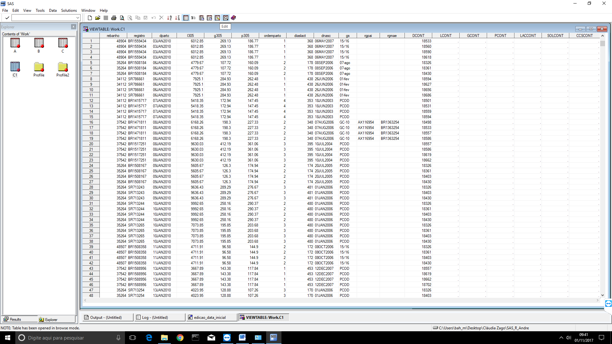

### R

```{r}
dataC1 <- dataC[!is.na(dataC$DCONT), ]

nrow(dataC1)

head(dataC1)
```


# Manter colunas com informações de interesse

### SAS

```{r eval = FALSE, hilang = 'sas'}
/* MANTER APENAS AS COLUNAS COM INFORMAÇÕES QUE ME INTERESSAM */
DATA C2; SET C1;
KEEP REBANHO REGISTRO DPARTO L305 G305 P305 ORDEMPARTO DIASLACT DNASC GS RGPAI RGMAE DCONT;
RUN; /*  10.894 observations and 13 variables */
```

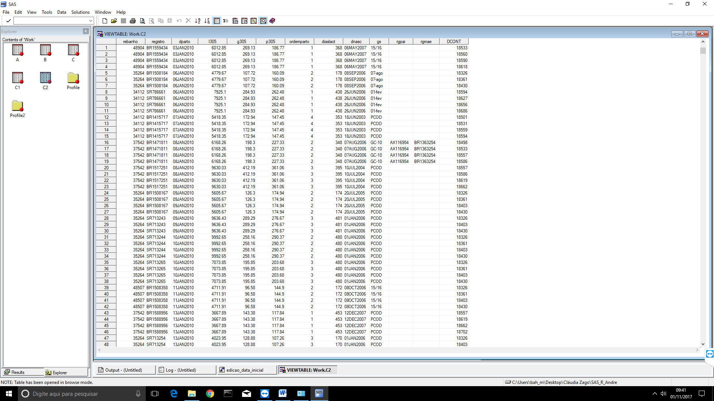


### R

```{r}
dataC2 <- dataC1[, c("rebanho", "registro", "dparto", "l305", "g305", "p305", "ordemparto", "diaslact", "dnasc", "gs", "rgpai", "rgmae", "DCONT")]

dim(dataC2)

head(dataC2)
```


# Manter apenas informações do primeiro controle

### SAS

```{r eval = FALSE, hilang = 'sas'}
/* MANTER APENAS AS INFORMÇÕES DO PRIMEIRO CONTROLE */
/* aqui eu não consigo ter certeza que o primeiro controle o é de fato, sei que é o controle com a data mais antiga */
DATA C3; SET C2;
BY DPARTO REGISTRO ; 
IF FIRST.REGISTRO THEN OUTPUT;
RUN; /* 2.960 observations and 13 variables */
```

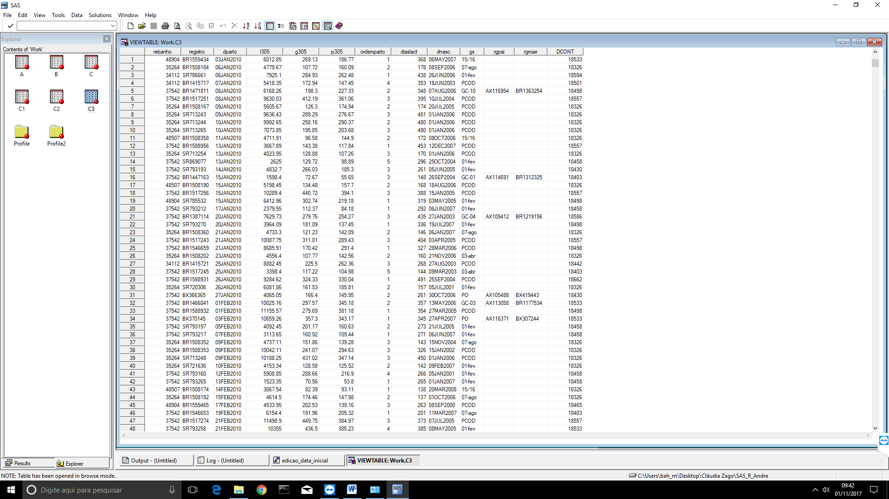


### R

```{r}
dataC3 <- dataC2[order(dataC2$dparto, dataC2$registro), ]

dataC3 <- dataC3[!duplicated(paste0(dataC3$registro, dataC3$dparto)), ]

dim(dataC3)

head(dataC3)
```


# Comando para contar número de pais e mães

### SAS

```{r eval = FALSE, hilang = 'sas'}
/* COMANDO PARA CONTAR NÚMERO DE PAIS E MÃES - DENTRO OS ANIMAIS LISTADOS NAS COLUNAS REGISTRO E PAIS/MÃES */
/* Pais */
DATA AN; SET C3;
REG=REGISTRO;
KEEP REG; PROC SORT; BY REG;
 
DATA PAI; SET C3;
REG=RGPAI;
KEEP REG; PROC SORT NODUPKEY; BY REG;
 
DATA AN_PAI; MERGE AN (in=x) PAI (in=y);
BY REG; IF X AND Y;
RUN; /* 0 PAIS */


/* Mães */
DATA AN; SET C3;
REG=REGISTRO;
KEEP REG; PROC SORT; BY REG;
 
DATA MAE; SET C3;
REG=RGMAE;
KEEP REG; PROC SORT NODUPKEY; BY REG;
 
DATA AN_MAE; MERGE AN (in=x) MAE (in=y);
BY REG; IF X AND Y;
RUN; /* 471 MAES */
```

### R

```{r}
# Pais
AN <- data.frame(reg = dataC3$registro)
PAI <- data.frame(reg = unique(dataC3[!is.na(dataC3$rgpai), "rgpai"]))

AN_PAI <- merge(AN, PAI, by = "reg")
nrow(AN_PAI)

# Maes
AN <- data.frame(reg = dataC3$registro)
MAE <- data.frame(reg = unique(dataC3[!is.na(dataC3$rgmae), "rgmae"]))

AN_MAE <- merge(AN, MAE, by = "reg")
nrow(AN_MAE)

# Se for so pra saber o numero (nao precisar dos objetos criados), podemos fazer em uma linha de codigo:
sum(dataC3$registro %in% unique(dataC3$rgmae))
```


# Contar número de vacas por ordem de parto

### SAS

```{r eval = FALSE, hilang = 'sas'}
DATA C4; SET C3;
PROC FREQ; TABLE ORDEMPARTO;
RUN;  
/*   1        1221       41.25          1221        41.25
     2         843       28.48          2064        69.73
     3         503       16.99          2567        86.72
     4         242        8.18          2809        94.90
     5         107        3.61          2916        98.51
     6          28        0.95          2944        99.46
     7          12        0.41          2956        99.86
     8           3        0.10          2959        99.97
    10           1        0.03          2960       100.00
 */
```

### R

```{r}
table(dataC3$ordemparto)
prop.table(table(dataC3$ordemparto))
cumsum(table(dataC3$ordemparto))
cumsum(prop.table(table(dataC3$ordemparto)))
```


# Manter apenas ordem de parto 1

### SAS

```{r eval = FALSE, hilang = 'sas'}
DATA C5; SET C3;
IF ORDEMPARTO NE 1 THEN DELETE; 
RUN; /* 1.221 observations and 13 variables */
```

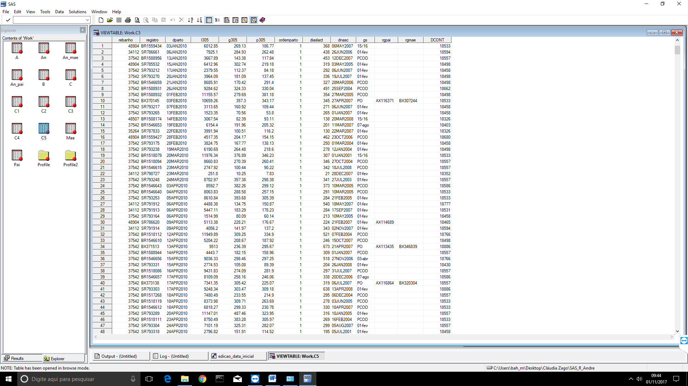


### R

```{r}
dataC5 <- dataC3[dataC3$ordemparto == 1, ]

dim(dataC5)

head(dataC5)
```


# Cálculo de variáveis e edição - Ex. Idade

### SAS
```{r eval = FALSE, hilang = 'sas'}
DATA C6; SET C5;
IDADE=ROUND((DPARTO-DNASC)/30.5); *idade em meses;
IF IDADE <=20 THEN DELETE;
IF IDADE >= 40 THEN DELETE;
RUN;
/* 842 observations and 14 variables */
```


### R

```{r}
dataC5$idade <- as.numeric(round((as.Date(dataC5$dparto) - as.Date(dataC5$dnasc))/30.5))

dataC6 <- dataC5[dataC5$idade > 20 & dataC5$idade < 40, ]

dim(dataC6)
```

### SAS
```{r eval = FALSE, hilang = 'sas'}
DATA C8; SET C6; 
IF L305 > (6312.26 + (3*2436.21)) THEN DELETE;
IF L305 < (6312.26 - (3*2436.21)) THEN DELETE;                                       
IF G305 > (243.16 + (3*91.09)) THEN DELETE;
IF G305 < (243.16 - (3*91.09)) THEN DELETE;
IF P305 > (205.57 + (3*77.68)) THEN DELETE;
IF P305 < (205.57 - (3*77.68)) THEN DELETE;
RUN; /* 842 observations and 14 variables */
```


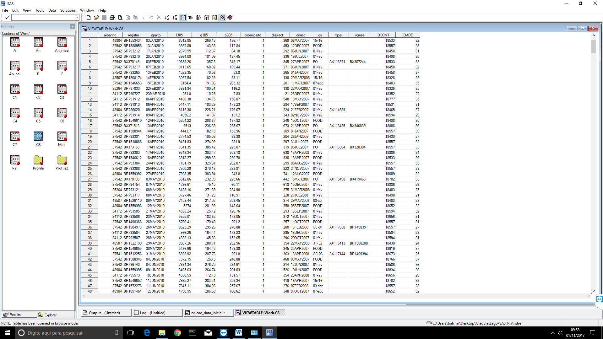


### R

```{r}
dataC8 <- dataC6[(dataC6$l305 <= mean(dataC6$l305) + 3*sd(dataC6$l305) & dataC6$l305 >= mean(dataC6$l305) - 3*sd(dataC6$l305)) | dataC6$g305 <= mean(dataC6$g305) + 3*sd(dataC6$g305) & dataC6$g305 >= mean(dataC6$g305) - 3*sd(dataC6$g305) | dataC6$p305 <= mean(dataC6$p305) + 3*sd(dataC6$p305) & dataC6$p305 >= mean(dataC6$p305) - 3*sd(dataC6$p305), ]

dim(dataC8)

head(dataC8)
```

# Separação de dia, mês e ano de uma data composta

### SAS
```{r eval = FALSE, hilang = 'sas'}
DATA C9; SET C8;
DIAP=DAY(DPARTO);
MESP=MONTH(DPARTO);
ANOP=YEAR(DPARTO);
RUN; /* 842 observations and 17 variables */
```

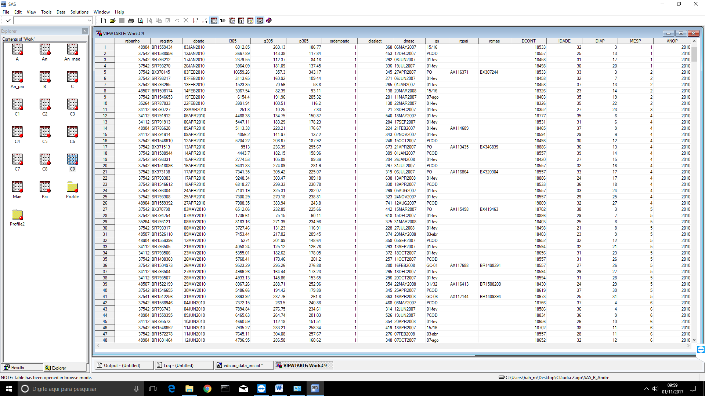

### R

```{r}
dataC8$diap <- format(as.Date(dataC8$dparto), "%d")
dataC8$mesp <- format(as.Date(dataC8$dparto), "%m")
dataC8$anop <- format(as.Date(dataC8$dparto), "%Y")

dataC9 <- dataC8

head(dataC9)
```


# Gráfico de dispersão em formato de letras

### SAS
```{r eval = FALSE, hilang = 'sas'}
DATA D; SET C8;
PROC PLOT; PLOT IDADE*ANOP;
RUN;
```

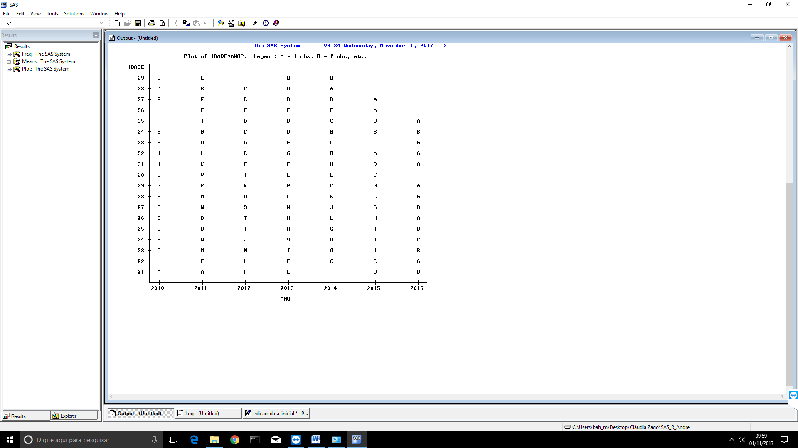


### R

```{r}
plot(idade ~ anop, data = dataC8, pch = 16, col = rgb(0, 0, 0, alpha = 0.1))

# pra quem quer mesmo letras..
procPlot <- function(x, y, ...){
  paraPlot <- as.data.frame(table(x, y))
  paraPlot <- paraPlot[paraPlot$Freq > 0, ]
  plot(as.numeric(as.character(paraPlot$x)), as.numeric(as.character(paraPlot$y)), type = "n", xlab = "", ylab = "", ...)
  text(as.numeric(as.character(paraPlot$x)), as.numeric(as.character(paraPlot$y)), labels = LETTERS[paraPlot$Freq])
}

procPlot(dataC8$anop, dataC8$idade)
```


# Gráfico de dispersão

### SAS
```{r eval = FALSE, hilang = 'sas'}
DATA D1; SET C8;
PROC GPLOT; PLOT IDADE*ANOP;
RUN;
```

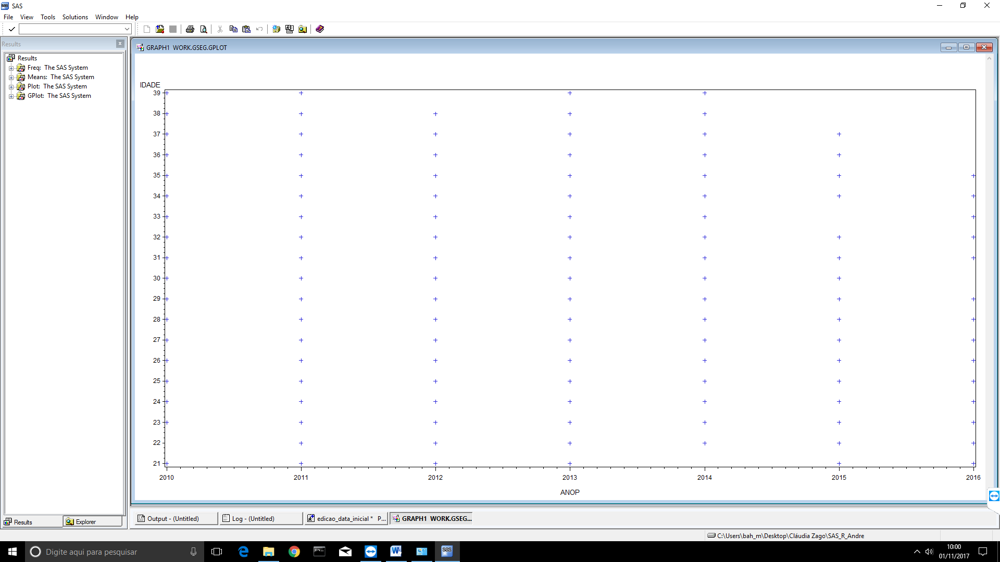

### R


```{r}
plot(dataC8$idade ~ dataC8$anop)
```


# Correlação de Pearson

### SAS
```{r eval = FALSE, hilang = 'sas'}
DATA D2; SET C8;
PROC CORR; VAR L305 IDADE; 
TITLE 'CORRELAÇAO ENTRE L305 E IDADE DE VACAS HOLANDESAS';
RUN;
```

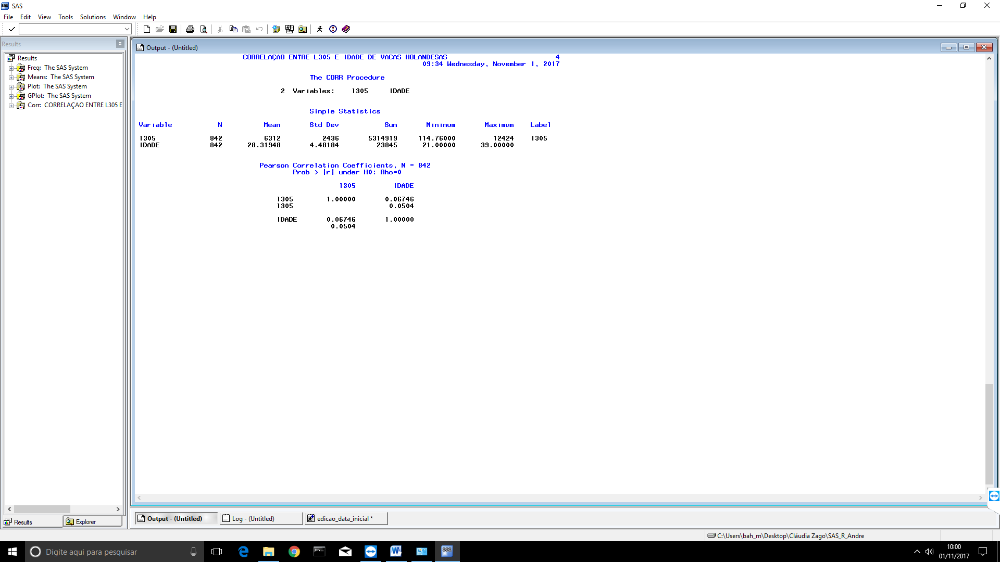


### R

```{r}
cor.test(dataC8$l305, dataC8$idade)
```


# Correlação de Spearman

### SAS

```{r eval = FALSE, hilang = 'sas'}
DATA D3; SET C8;
PROC CORR SPERMAN; VAR L305 IDADE; 
TITLE 'CORRELAÇAO ENTRE L305 E IDADE DE VACAS HOLANDESAS';
RUN;
```

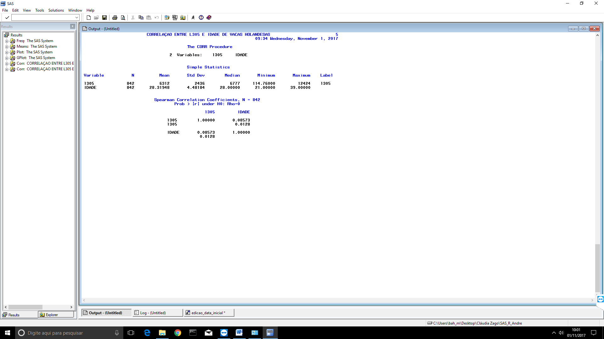


### R


```{r}
cor.test(dataC8$l305, dataC8$idade, method = "spearman")
```

# Regressão

### SAS
```{r eval = FALSE, hilang = 'sas'}
/* LEITE X IDADE */
PROC REG DATA = C8;
MODEL L305 = DIASLACT;
PLOT L305 * DIASLACT = 'SIMBOL';
RUN;
```

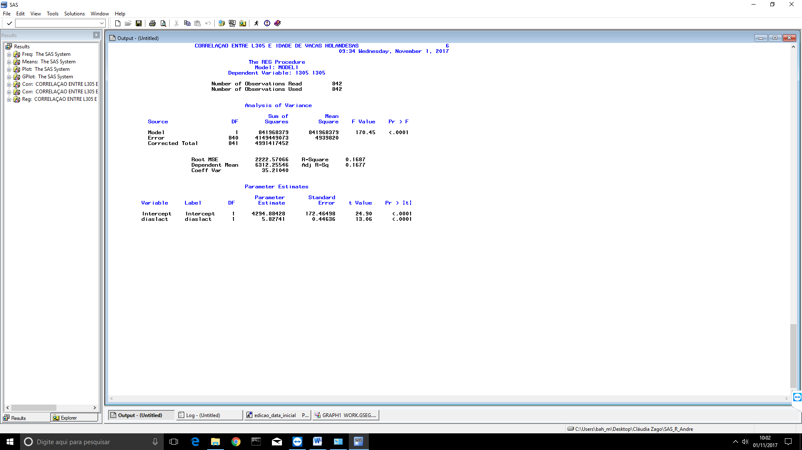


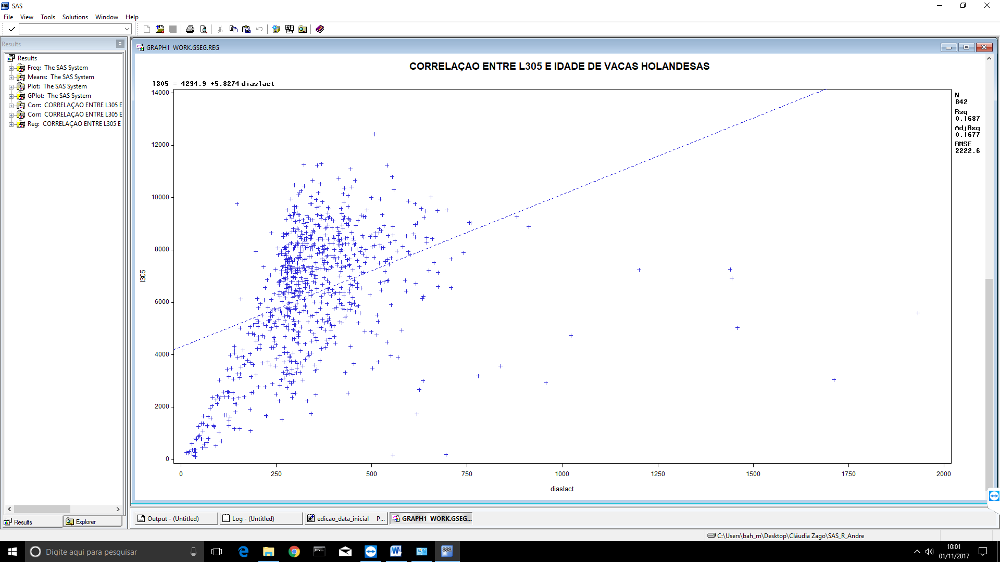

### R

```{r}
lm1 <- lm(l305 ~ diaslact, data = dataC8)

anova(lm1)

summary(lm1)

plot(l305 ~ diaslact, data = dataC8, col = "blue", pch = 3)
abline(lm1)
```


# Inserir dados digitando

### SAS
```{r eval = FALSE, hilang = 'sas'}
DATA E;
INPUT TRAT $ DOSE @@;
CARDS; 
1 24.1	2 15.5	3 19.3	4 18.7
1 23.5	2 19.1	3 19.2	4 21.2
1 20.7	2 16.6	3 17.7	4 18.7
1 23.5	2 19.1	3 21.7	4 21.2
1 22.7	2 18.2	3 18.6	4 19.2
;
RUN; /* 20 observations and 2 variables */
```

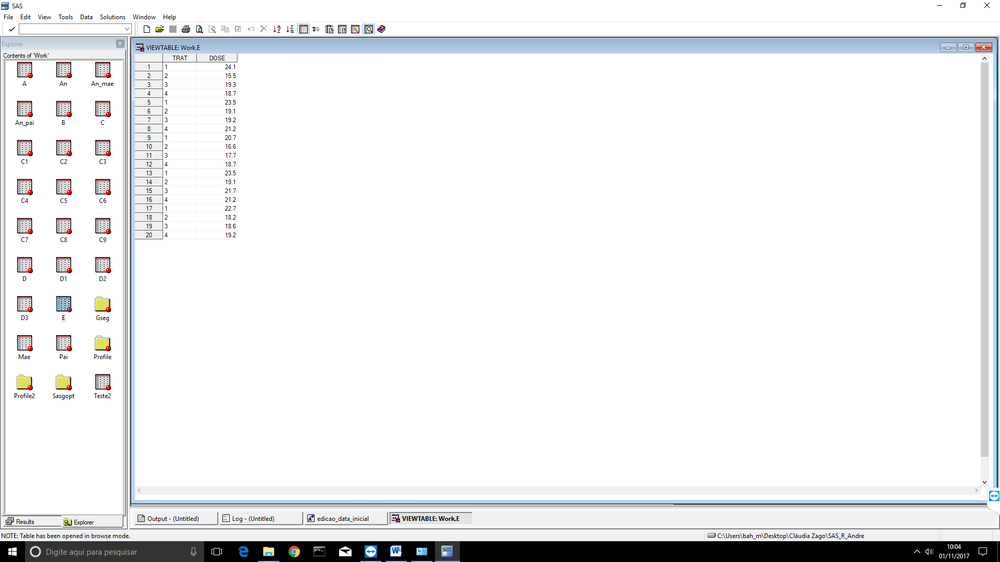

### R
```{r}
# Primeiro criar os vetores de trat e dose
trat <- c(1, 1, 1, 1, 1, 2, 2, 2, 2, 2, 3, 3, 3, 3, 3, 4, 4, 4, 4, 4)
dose <- c(24.1, 23.5, 20.7, 23.5, 22.7, 15.5, 19.1, 16.6, 19.1, 18.2, 19.3, 19.2, 17.7, 21.7, 18.6, 18.7, 21.2, 18.7, 21.2, 19.2)
# juntar os vetores no data frame E
dataE <- data.frame(trat, dose)
```

```{r, echo = FALSE}
dataE
```

# Fazer teste de Tukey

### SAS

```{r eval = FALSE, hilang = 'sas'}
DATA E1; SET E;
PROC GLM;
CLASS TRAT;
MODEL DOSE=TRAT;
MEANS TRAT/TUKEY;
RUN;
```

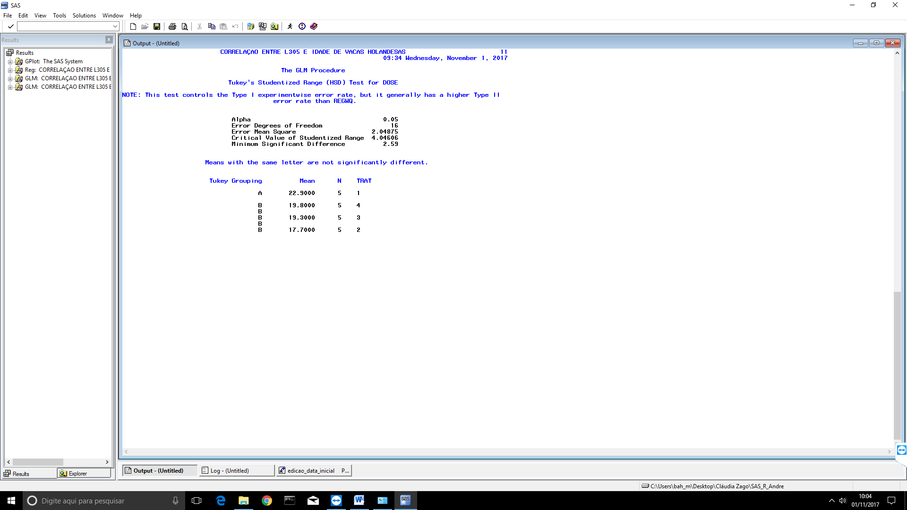

### R
```{r}
dataE1 <- aov(dose ~ factor(trat), data = dataE) # fazer ANOVA, primeiramente

summary(dataE1)

qtukey(p = 0.95, nmeans = 4, df = 16) # amplitude total studentizada

4.0461*sqrt(2.0487/5) # diferença mínima significativa

aggregate(dose ~ trat, data = dataE, FUN = mean) # médias por tratamento

TukeyHSD(dataE1) # teste Tukey, sem letrinhas...

# ..mas com gráfico
plot(TukeyHSD(dataE1))
```


# Exportar arquivo em Excel

### SAS
```{r eval = FALSE, hilang = 'sas'}
PROC EXPORT DATA= WORK.C8 
            OUTFILE= "F:\2017\Doutorado\Disciplinas\R\data_final.xlsx" 
            DBMS=EXCELCS REPLACE;
     SHEET="data_final"; 
RUN;
```

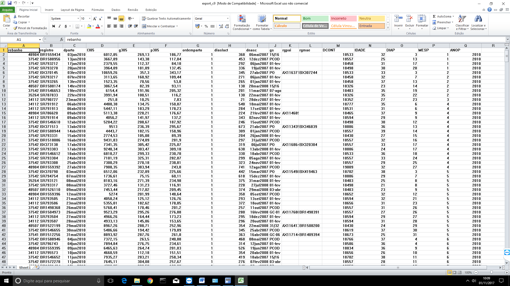

### R

```{r}
write.csv(dataC8, file = "data_final.csv", row.names = FALSE) # ou write.csv2
```

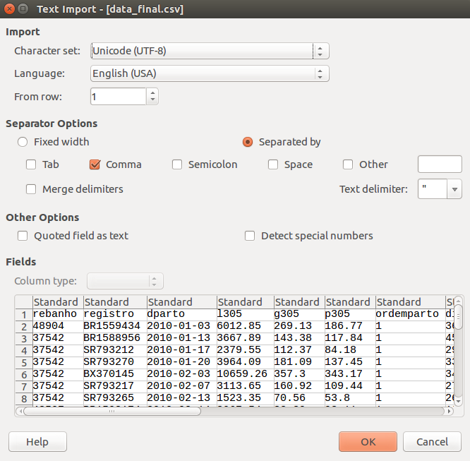

---
